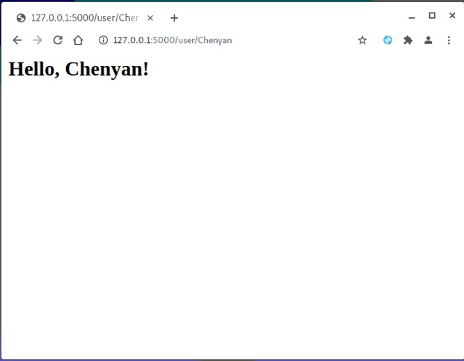

# ECE444-F2021-Lab 2

Chenyan Wang  

This repo is a clone of https://github.com/miguelgrinberg/flask

## Activity 1
  

## Activity 2
To run the flask server, instead of running "python hello.py", I ran the following:  

export FLASK_APP=hello.py  
flask run  

Reproduced example 2-2 to add dynamic routes:  
  

## Activity 3
Added a navigation bar, "Hello Chenyan!" as title, and timestamp.  

  

## Activity 4

Created a form for name and UofT email.  

### Activity 4-2
Screenshot after running the project.  

  

### Activity 4-3
Screenshot after filling first name and UofT email address.  

  

### Activity 4-4
Screenshot after filling first name and last name in 1st field, and first name in 2nd field.  

  

### Activity 4-5
Screenshot after filling first name and last name in 1st field, and non-UofT email in 2nd field.  

  
